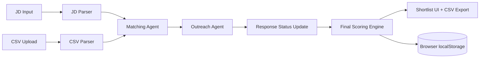

# Architecture and Scoring

## High-Level Flow

1. User enters Job Description (JD)
2. JD parser extracts role, skills, and experience requirement
3. Candidate CSV is uploaded and parsed
4. Matching engine computes:
   - matched skills
   - missing skills
   - skill score
   - experience score
5. Outreach module prepares email outreach and captures response status
6. Final scoring combines skills, experience, availability, and interest
7. Shortlist is ranked and exportable as CSV

## Architecture Diagram

## Core Modules

- `src/agents/jdParser.ts`  
  Extracts role, skills, and required years.

- `src/lib/csvParser.ts`  
  Parses CSV with skill normalization and email extraction.

- `src/agents/matchingAgent.ts`  
  Canonical skill matching and baseline match score.

- `src/agents/outreachAgent.ts`  
  Outreach email template generation, availability scoring, response-to-interest mapping.

- `src/lib/scoring.ts`  
  Final weighted score + recommendation generation.

## Scoring Details

### 1) Match Layer

- Skill score = matched JD skills / total JD skills (in %)
- Experience score = 100 if candidate experience meets requirement, else proportional
- Match score = `0.7 * skill + 0.3 * experience`

### 2) Outreach/Availability Layer

- Availability score mapping:
  - Immediate: 100
  - 15 days: 80
  - ~2 weeks: 75
  - 30 days / 1 month: 60
  - 45-60 days: 40
- Interest score mapping from response:
  - Interested: 100
  - Maybe: 60
  - Not interested: 0
  - No response: 40

### 3) Final Ranking

Final score is calculated as:

`Final = 0.4 * Skill + 0.25 * Experience + 0.15 * Availability + 0.2 * Interest`

Recommended action:
- `>= 80`: Proceed to interview
- `50-79`: Keep warm
- `< 50`: Reject
